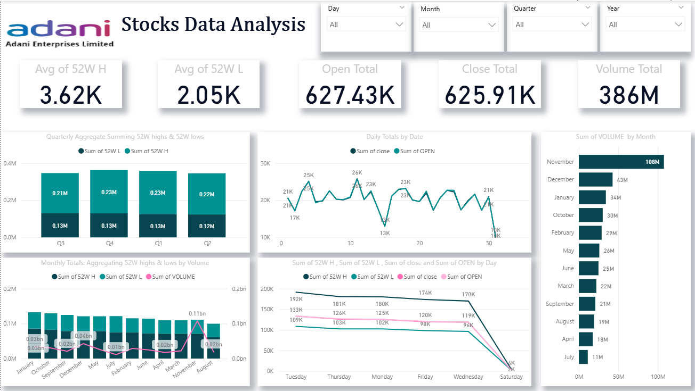

# Adani Enterprises Stock Analysis Dashboard
This repository showcases a data analytics project on Adani Enterprises, highlighting end-to-end data preparation and visualization using Excel and Power BI. The dashboard captures one year of stock market activity (NSE data) and delivers actionable insights through KPIs and interactive visuals.

## Tools & Technologies
- **Excel** → Data preprocessing, cleaning, and transformations  
- **Power BI** → Dashboard design, KPIs, and visual storytelling  

## Methodology
1. **Data Preparation (Excel)**
   - Extracted time-based attributes (day, month, quarter, year) using `TEXT()`.  
   - Removed duplicates and treated null values to ensure reliable analysis.  

2. **Visualization & Reporting (Power BI)**
   - Built an interactive dashboard with performance indicators, trend analysis, and drill-downs.  

## Dashboard Highlights

### Key Metrics
- Avg. 52-Week High: **3.91K**  
- Avg. 52-Week Low: **1.14K**  
- Total Close Price: **667.66K**  
- Total Open Price: **669.55K**  
- Total Volume: **876M**  

### Major Visuals
- **Quarterly View** → Q4 stands out with the highest aggregate 52W High.  
- **Daily Movement** → Peaks in Open/Close prices highlight volatility.  
- **Monthly Trends** → May saw the largest trade volume (0.15bn).  
- **Day-of-Week Analysis** → Lower trading activity during weekends.  
- **Volume Distribution** → May and August emerge as peak trading months.  

## Insights & Takeaways
- **Trading Volume:** May and August indicate heightened market participation.  
- **Quarterly Strength:** Q4 reflects the strongest performance across metrics.  
- **Market Behavior:** Weekends display predictable inactivity.  
- **Investor Confidence:** Consistent Open and Close totals show stability.  

## Future Enhancements
- Integrate live NSE data for real-time dashboard updates.  
- Automate data refresh using Power BI Service.  
- Expand KPIs to include moving averages and investor sentiment indicators.  
